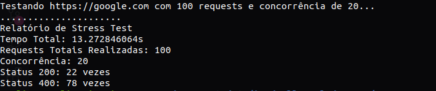
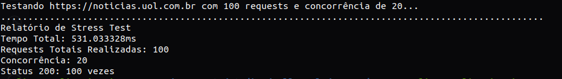

# Desafio Técnico 2 - Stress Test (Pós Graduação GoExpert)

### DESCRIÇÃO DO DESAFIO

**Objetivo:** Criar um sistema CLI em Go para realizar testes de carga em um serviço web. O usuário deverá fornecer a URL do serviço, o número total de requests e a quantidade de chamadas simultâneas.

O sistema deverá gerar um relatório com informações específicas após a execução dos testes.

**Entrada de Parâmetros via CLI:**

**--url:** URL do serviço a ser testado.

**--requests:** Número total de requests.

**--concurrency:** Número de chamadas simultâneas.


**Execução do Teste:**

- Realizar requests HTTP para a URL especificada.
- Distribuir os requests de acordo com o nível de concorrência definido.
- Garantir que o número total de requests seja cumprido.

**Geração de Relatório:**

- Apresentar um relatório ao final dos testes contendo:
  - Tempo total gasto na execução
  - Quantidade total de requests realizados.
  - Quantidade de requests com status HTTP 200.
  - Distribuição de outros códigos de status HTTP (como 404, 500, etc.).

**Execução da aplicação:**
- Poderemos utilizar essa aplicação fazendo uma chamada via docker.
    
    Ex:
  - docker run <sua imagem docker> —url=http://google.com —requests=1000 —concurrency=10

### PRÉ-REQUISITOS

#### 1. Instalar o GO no sistema operacional:

É possível encontrar todas as instruções de como baixar e instalar o GO nos sistemas operacionais Windows, Mac ou Linux [aqui](https://go.dev/doc/install).

#### 2. Clonar o repositório:

```
git clone git@github.com:raphapaulino/pos-graduacao-goexpert-desafio-tecnico-2-stress-test
```

#### 3. Instalar o Docker no sistema operacional:

É possível encontrar todas as instruções de como baixar e instalar o Docker nos sistemas operacionais Windows, Mac ou Linux [aqui](https://docs.docker.com/engine/install/).

### EXECUTANDO O PROJETO

1. Estando na raiz do projeto, via terminal, construa a imagem do projeto via Docker da seguinte forma:

```
docker build -t stresstestapp .
```

2. Ainda na raiz do projeto, via terminal, executar o comando abaixo que irá iniciar os testes de carga:

```
go run main.go --url=https://google.com --requests=100 --concurrency=20
```
ou

```
docker run stresstestapp --url=https://noticias.uol.com.br --requests=100 --concurrency=20
```

Os testes acima irão gerar resultados semelhantes a esses:



